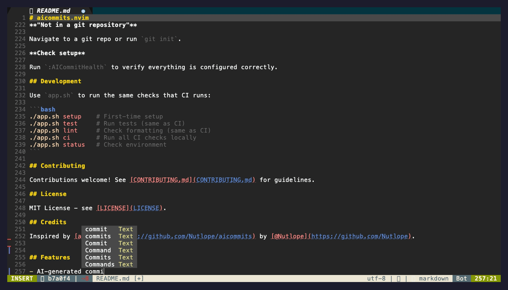

# aicommits.nvim

AI-powered git commit messages directly in Neovim.

[](https://opensource.org/licenses/MIT)

<div align="center">
  
</div>

## What is this?

This plugin generates conventional commit messages using AI. Stage your changes, run `:AICommit`, and get a properly formatted commit message. It's that simple.

## Requirements

- Neovim 0.9+
- Git
- API key for your chosen provider (OpenAI or Google Vertex AI)
- curl

## Installation

### lazy.nvim

Minimal setup:
```lua
{
  "pilo404/aicommits.nvim",
  config = true,
}
```

With custom config:
```lua
{
  "pilo404/aicommits.nvim",
  config = function()
    require("aicommits").setup({
      providers = {
        openai = {
          model = "gpt-4.1-nano",
          max_length = 72,
          generate = 3,
        },
      },
    })
  end,
}
```

### Other plugin managers

**packer.nvim:**
```lua
use {
  "pilo404/aicommits.nvim",
  config = function()
    require("aicommits").setup()
  end
}
```

**vim-plug:**
```vim
Plug 'pilo404/aicommits.nvim'

lua << EOF
require("aicommits").setup()
EOF
```

## Setup

### OpenAI

Set your OpenAI API key:

```bash
export AICOMMITS_NVIM_OPENAI_API_KEY="sk-..."
```

Or use the standard OpenAI environment variable:

```bash
export OPENAI_API_KEY="sk-..."
```

### Google Vertex AI

Set your Vertex AI API key and configure the provider:

```bash
export VERTEX_API_KEY="your-vertex-api-key"
```

Or use the plugin-specific environment variable:

```bash
export AICOMMITS_NVIM_VERTEX_API_KEY="your-vertex-api-key"
```

Configure in your Neovim setup:

```lua
require("aicommits").setup({
  active_provider = "vertex",
  providers = {
    vertex = {
      enabled = true,
      model = "gemini-2.0-flash-lite",
      project = "your-gcp-project-id",  -- Required: Your GCP project ID
      location = "us-central1",         -- GCP region
      max_length = 50,
      temperature = 0.7,
    },
  },
})
```

**Note:** Vertex AI requires a GCP project ID. Make sure you have enabled the Vertex AI API in your Google Cloud project.

Add environment variables to your shell config (`~/.bashrc`, `~/.zshrc`, etc.) and restart your shell.

## Usage

```bash
# Stage changes
git add .
```

In Neovim:
```vim
:AICommit
```

The plugin will:
1. Analyze your changes
2. Generate commit message(s)
3. Show a picker
4. Create the commit

### Neogit Integration

If you use Neogit, press `C` in the status buffer to trigger AI commits.

## Configuration

All options with defaults:

```lua
require("aicommits").setup({
  -- Provider Configuration
  active_provider = "openai",  -- Which AI provider to use

  providers = {
    -- OpenAI Configuration
    openai = {
      enabled = true,          -- Enable/disable this provider
      api_key = nil,           -- API key (nil = use environment variables)
      endpoint = nil,          -- Custom endpoint (nil = use default)
      model = "gpt-4.1-nano",  -- Which model to use
      max_length = 50,         -- Max characters in commit message
      generate = 1,            -- Number of options (1-5)
      -- Advanced options
      temperature = 0.7,       -- Sampling temperature (0-2)
      top_p = 1,              -- Nucleus sampling parameter
      frequency_penalty = 0,   -- Frequency penalty (-2 to 2)
      presence_penalty = 0,    -- Presence penalty (-2 to 2)
      max_tokens = 200,        -- Maximum tokens in response
    },
    -- Google Vertex AI Configuration
    vertex = {
      enabled = false,         -- Enable/disable this provider
      api_key = nil,           -- API key (nil = use environment variables)
      model = "gemini-2.0-flash-lite",  -- Vertex AI model
      project = nil,           -- GCP project ID (required)
      location = "us-central1", -- GCP region
      max_length = 50,         -- Max characters in commit message
      temperature = 0.7,       -- Sampling temperature (0-2)
      max_tokens = 200,        -- Maximum tokens in response
    },
    -- Future providers can be added here
    -- anthropic = { ... },
    -- ollama = { ... },
  },

  -- UI settings
  ui = {
    use_custom_picker = true,  -- Custom picker vs vim.ui.select
    picker = {
      width = 0.4,             -- Percentage of screen width
      height = 0.3,            -- Percentage of screen height
      border = "rounded",      -- Border style
    },
  },

  -- Integrations
  integrations = {
    neogit = {
      enabled = true,          -- Auto-refresh after commit
      mappings = {
        enabled = true,        -- Add keymap in status buffer
        key = "C",            -- Which key to use
      },
    },
  },

  -- Debugging
  debug = false,
})
```

### Provider Configuration

The plugin uses a provider system to support multiple AI services. Each provider has its own configuration section under `providers`.

#### Supported Providers

- **OpenAI** - OpenAI GPT models (default)
- **Vertex AI** - Google Vertex AI Gemini models

#### OpenAI Provider

**Configure OpenAI with custom settings:**
```lua
require("aicommits").setup({
  active_provider = "openai",
  providers = {
    openai = {
      model = "gpt-4.1-nano",      -- Use a different model
      max_length = 72,      -- Longer commit messages
      generate = 3,         -- Generate 3 options to choose from
    },
  },
})
```

**Use a custom OpenAI-compatible endpoint:**
```lua
require("aicommits").setup({
  providers = {
    openai = {
      endpoint = "https://your-proxy.com/v1/chat/completions",
      api_key = "your-api-key",  -- Or use environment variables
      model = "gpt-4.1-nano",
    },
  },
})
```

#### Vertex AI Provider

**Configure Vertex AI Gemini:**
```lua
require("aicommits").setup({
  active_provider = "vertex",
  providers = {
    vertex = {
      enabled = true,
      model = "gemini-2.0-flash-lite",
      project = "my-gcp-project",      -- Required: Your GCP project ID
      location = "us-central1",        -- GCP region
      max_length = 50,
      temperature = 0.7,
      max_tokens = 200,
    },
  },
})
```

**API Key Configuration:**

Vertex AI supports multiple ways to set your API key:

1. **Environment variable (recommended):**
   ```bash
   export VERTEX_API_KEY="your-api-key"
   # or
   export AICOMMITS_NVIM_VERTEX_API_KEY="your-api-key"
   ```

2. **Direct configuration:**
   ```lua
   providers = {
     vertex = {
       api_key = "your-api-key",  -- Not recommended for security
     },
   }
   ```

### UI Configuration

**Use vim.ui.select instead of custom picker:**
```lua
require("aicommits").setup({
  ui = {
    use_custom_picker = false,
  },
})
```

### Integration Configuration

**Disable Neogit integration:**
```lua
require("aicommits").setup({
  integrations = {
    neogit = { enabled = false },
  },
})
```

## Commands

| Command | What it does |
|---------|-------------|
| `:AICommit` | Generate and create commit |
| `:AICommitHealth` | Check if everything is set up |
| `:AICommitDebug` | Show debug info |

## Commit Format

All commits follow Conventional Commits:

```
<type>(<scope>): <description>
```

Types:
- `feat` - New feature
- `fix` - Bug fix
- `docs` - Documentation
- `style` - Formatting
- `refactor` - Code restructuring
- `perf` - Performance
- `test` - Tests
- `build` - Build system
- `ci` - CI changes
- `chore` - Other

Examples:
```
feat(auth): add OAuth2 support
fix(api): handle null responses
docs: update installation steps
```

## Troubleshooting

**"OpenAI API key not found"**

Set the environment variable and restart Neovim.

**"No staged changes found"**

Run `git add` first.

**"Not in a git repository"**

Navigate to a git repo or run `git init`.

**Check setup**

Run `:AICommitHealth` to verify everything is configured correctly.

## Development

Use `app.sh` to run the same checks that CI runs:

```bash
./app.sh setup    # First-time setup
./app.sh test     # Run tests (same as CI)
./app.sh lint     # Check formatting (same as CI)
./app.sh ci       # Run all CI checks locally
./app.sh status   # Check environment
```

## Contributing

Contributions welcome! See [CONTRIBUTING.md](CONTRIBUTING.md) for guidelines.

## License

MIT License - see [LICENSE](LICENSE).

## Credits

Inspired by [aicommits](https://github.com/Nutlope/aicommits) by [@Nutlope](https://github.com/Nutlope).
