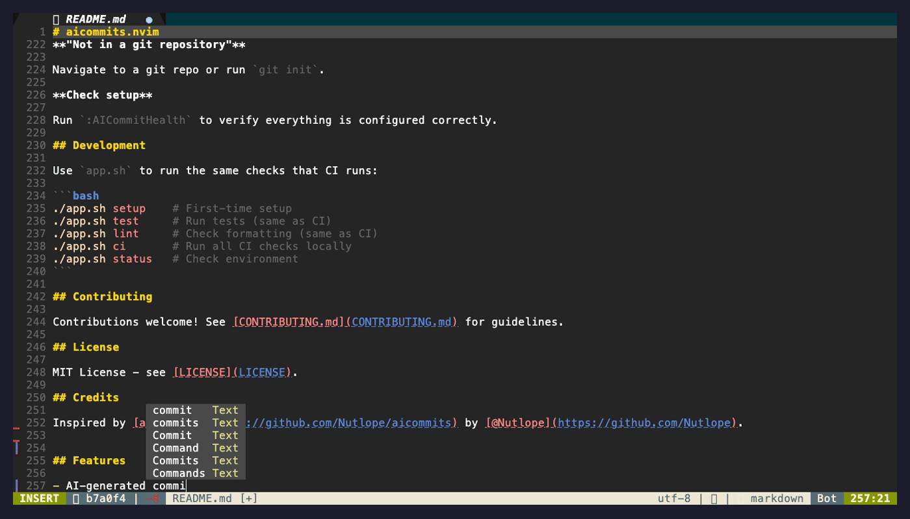

# aicommits.nvim

AI-powered git commit messages directly in Neovim.

[](https://opensource.org/licenses/MIT)

<div align="center">
  
</div>

## What is this?

This plugin generates conventional commit messages using AI. Stage your changes, run `:AICommit`, and get a properly formatted commit message. It's that simple.

## Requirements

- Neovim 0.9+
- Git
- curl
- **For OpenAI**: API key
- **For Vertex AI**: gcloud CLI + authentication (user credentials or service account)
- **For Anthropic Claude**: API key

## Installation

### lazy.nvim

Minimal setup:
```lua
{
  "pilo404/aicommits.nvim",
  config = true,
}
```

With custom config:
```lua
{
  "pilo404/aicommits.nvim",
  config = function()
    require("aicommits").setup({
      providers = {
        openai = {
          model = "gpt-5.6-luna",
          max_length = 72,
          generate = 3,
        },
      },
    })
  end,
}
```

### Other plugin managers

**packer.nvim:**
```lua
use {
  "pilo404/aicommits.nvim",
  config = function()
    require("aicommits").setup()
  end
}
```

**vim-plug:**
```vim
Plug 'pilo404/aicommits.nvim'

lua << EOF
require("aicommits").setup()
EOF
```

## Setup

### OpenAI

Set your OpenAI API key:

```bash
export AICOMMITS_NVIM_OPENAI_API_KEY="sk-..."
```

Or use the standard OpenAI environment variable:

```bash
export OPENAI_API_KEY="sk-..."
```

### Google Vertex AI

**Prerequisites:**
- gcloud CLI installed: https://cloud.google.com/sdk/install
- GCP project with Vertex AI API enabled

**Authentication Setup:**

Choose one of the following methods:

1. **User credentials (recommended for development):**
   ```bash
   gcloud auth application-default login
   ```

2. **Service account (recommended for production):**
   ```bash
   export GOOGLE_APPLICATION_CREDENTIALS="/path/to/service-account.json"
   ```

**Configure in your Neovim setup:**

```lua
require("aicommits").setup({
  active_provider = "vertex",
  providers = {
    vertex = {
      enabled = true,
      model = "gemini-2.0-flash-lite",
      project = "your-gcp-project-id",  -- Required: Your GCP project ID
      location = "us-central1",         -- GCP region
      max_length = 50,
      generate = 3,                     -- Generate 3 options to choose from
      temperature = 0.7,
    },
  },
})
```

**Note:** Authentication is handled automatically via gcloud. The plugin will call `gcloud auth application-default print-access-token` to obtain OAuth tokens as needed. Tokens are cached for 55 minutes to minimize gcloud calls.

### Google Gemini API (AI Studio)

**Simpler alternative to Vertex AI** - uses Google AI Studio API with straightforward API key authentication.

**Prerequisites:**
- Google Account
- Get free API key from: https://aistudio.google.com

**Key Differences from Vertex AI:**

| Feature | Gemini API | Vertex AI |
|---------|------------|-----------|
| Authentication | Simple API key | Google Cloud credentials |
| Setup Required | Just get API key | GCP project, gcloud CLI |
| Target Users | Individuals, prototyping | Enterprise, production |
| Free Tier | Generous free tier | GCP billing required |

**Authentication Setup:**

Set your Gemini API key:

```bash
export AICOMMITS_NVIM_GEMINI_API_KEY="your-api-key-here"
```

Or use the generic Gemini environment variable:

```bash
export GEMINI_API_KEY="your-api-key-here"
```

**Configure in your Neovim setup:**

```lua
require("aicommits").setup({
  active_provider = "gemini-api",
  providers = {
    ["gemini-api"] = {
      enabled = true,
      model = "gemini-2.5-flash",      -- Latest Gemini model
      max_length = 50,
      generate = 3,                     -- Generate 1-8 commit message options
      temperature = 0.7,
      max_tokens = 200,
      thinking_budget = 0,              -- 0 = disabled (default, faster/cheaper), -1 = dynamic, 1-24576 = manual
    },
  },
})
```

**Available Models:**
- `gemini-2.5-flash` - Latest, recommended (GA)
- `gemini-2.0-flash-exp` - Experimental Gemini 2.0
- `gemini-1.5-flash` - Stable Gemini 1.5

**Performance Notes:**
- `thinking_budget` is set to `0` by default to disable internal reasoning, which keeps responses fast and token usage low
- With thinking disabled, 200 tokens is sufficient for generating commit messages
- You can enable thinking for potentially better quality by setting `thinking_budget = -1` (dynamic) or a specific value (1-24576)
- If you enable thinking, consider increasing `max_tokens` to 1000+ to accommodate reasoning tokens

**Note:** This provider uses the `generativelanguage.googleapis.com` API endpoint, which is completely separate from Vertex AI. No Google Cloud project or gcloud CLI required!

### Anthropic Claude

**Prerequisites:**
- Get API key from: https://console.anthropic.com

**Authentication Setup:**

Set your Anthropic API key:

```bash
export AICOMMITS_NVIM_ANTHROPIC_API_KEY="sk-ant-..."
```

Or use the standard Anthropic environment variable:

```bash
export ANTHROPIC_API_KEY="sk-ant-..."
```

**Configure in your Neovim setup:**

```lua
require("aicommits").setup({
  active_provider = "anthropic",
  providers = {
    anthropic = {
      enabled = true,
      model = "claude-haiku-4-5",
      max_length = 50,
      temperature = 0.7,
      max_tokens = 200,
    },
  },
})
```

## Usage

```bash
# Stage changes
git add .
```

In Neovim:
```vim
:AICommit
```

The plugin will:
1. Analyze your changes
2. Generate commit message(s)
3. Show a picker
4. Create the commit

### Neogit Integration

If you use Neogit, press `C` in the status buffer to trigger AI commits.

## Configuration

All options with defaults:

```lua
require("aicommits").setup({
  -- Provider Configuration
  active_provider = "openai",  -- Which AI provider to use

  providers = {
    -- OpenAI Configuration
    openai = {
      enabled = true,          -- Enable/disable this provider
      api_key = nil,           -- API key (nil = use environment variables)
      endpoint = nil,          -- Custom endpoint (nil = use default)
      model = "gpt-5.6-luna",  -- Which model to use (gpt-5-family/o-series models are treated as reasoning models)
      max_length = 50,         -- Max characters in commit message
      generate = 1,            -- Number of options (1-5)
      reasoning_effort = "none",  -- Reasoning models only (public API): none|low|medium|high|xhigh
      verbosity = "low",          -- Reasoning models only: low|medium|high
      -- Advanced options (ignored for reasoning models; see note below)
      temperature = 0.7,       -- Sampling temperature (0-2)
      top_p = 1,              -- Nucleus sampling parameter
      frequency_penalty = 0,   -- Frequency penalty (-2 to 2)
      presence_penalty = 0,    -- Presence penalty (-2 to 2)
      max_tokens = 200,        -- Maximum tokens in response
    },
    -- Google Vertex AI Configuration
    -- Requires gcloud CLI: https://cloud.google.com/sdk/install
    -- Authentication: gcloud auth application-default login
    -- Or set GOOGLE_APPLICATION_CREDENTIALS=/path/to/service-account.json
    vertex = {
      enabled = false,         -- Enable/disable this provider
      model = "gemini-2.0-flash-lite",  -- Vertex AI model
      project = nil,           -- GCP project ID (required)
      location = "us-central1", -- GCP region
      max_length = 50,         -- Max characters in commit message
      generate = 3,            -- Number of options (generates 3 by default)
      temperature = 0.7,       -- Sampling temperature (0-2)
      max_tokens = 200,        -- Maximum tokens in response
    },
    -- Google Gemini API (AI Studio) Configuration
    -- Get API key from: https://aistudio.google.com
    -- Simpler alternative to Vertex AI - no GCP project required
    ["gemini-api"] = {
      enabled = false,         -- Enable/disable this provider
      api_key = nil,          -- API key (nil = use environment variables)
      model = "gemini-2.5-flash", -- Gemini model (gemini-2.5-flash, gemini-2.0-flash-exp, gemini-1.5-flash)
      max_length = 50,         -- Max characters in commit message
      generate = 1,            -- Number of options (1-8)
      temperature = 0.7,       -- Sampling temperature (0-2)
      max_tokens = 200,        -- Maximum tokens in response
      thinking_budget = 0,     -- Thinking budget: 0 = disabled (default, faster/cheaper), -1 = dynamic, 1-24576 = manual
    },
    -- Anthropic Claude Configuration
    -- Get API key from: https://console.anthropic.com
    anthropic = {
      enabled = false,         -- Enable/disable this provider
      api_key = nil,          -- API key (nil = use environment variables)
      model = "claude-haiku-4-5", -- Claude model to use
      max_length = 50,         -- Max characters in commit message
      temperature = 0.7,       -- Sampling temperature (0-1)
      max_tokens = 200,        -- Maximum tokens in response
    },
    -- Future providers can be added here
    -- ollama = { ... },
  },

  -- UI settings
  ui = {
    use_custom_picker = true,  -- Custom picker vs vim.ui.select
    picker = {
      width = 0.4,             -- Percentage of screen width
      height = 0.3,            -- Percentage of screen height
      border = "rounded",      -- Border style
    },
  },

  -- Integrations
  integrations = {
    neogit = {
      enabled = true,          -- Auto-refresh after commit
      mappings = {
        enabled = true,        -- Add keymap in status buffer
        key = "C",            -- Which key to use
      },
    },
  },

  -- Debugging
  debug = false,
})
```

### Provider Configuration

The plugin uses a provider system to support multiple AI services. Each provider has its own configuration section under `providers`.

#### Supported Providers

- **OpenAI** - OpenAI GPT models (default)
- **Vertex AI** - Google Vertex AI Gemini models (enterprise, requires GCP)
- **Gemini API** - Google AI Studio API (simple API key, free tier available)
- **Anthropic Claude** - Anthropic's Claude models (simple API key)
- **Codex** - ChatGPT Codex OAuth session (spends ChatGPT subscription quota, disabled by default; see the risk disclosure below)

#### OpenAI Provider

**Configure OpenAI with custom settings:**
```lua
require("aicommits").setup({
  active_provider = "openai",
  providers = {
    openai = {
      model = "gpt-5.6-luna",      -- Use a different model
      max_length = 72,      -- Longer commit messages
      generate = 3,         -- Generate 3 options to choose from
    },
  },
})
```

`reasoning_effort` (`none`/`low`/`medium`/`high`/`xhigh`) and `verbosity` (`low`/`medium`/`high`) are optional and only take effect for gpt-5-family/o-series reasoning models like `gpt-5.6-luna`. For these models, `temperature`, `top_p`, `frequency_penalty`, and `presence_penalty` are ignored (fixed by the API), and `max_tokens` is sent as `max_completion_tokens` instead. Classic models like `gpt-4.1-nano` are unaffected and keep using all of the advanced options above. Note this is a different enum than the Codex provider below: the public API rejects `max` (Codex-only), while `minimal` is rejected by both providers entirely.

**Use a custom OpenAI-compatible endpoint:**
```lua
require("aicommits").setup({
  providers = {
    openai = {
      endpoint = "https://your-proxy.com/v1/chat/completions",
      api_key = "your-api-key",  -- Or use environment variables
      model = "gpt-4.1-nano",
    },
  },
})
```

#### Vertex AI Provider

**Configure Vertex AI Gemini:**
```lua
require("aicommits").setup({
  active_provider = "vertex",
  providers = {
    vertex = {
      enabled = true,
      model = "gemini-2.0-flash-lite",
      project = "my-gcp-project",      -- Required: Your GCP project ID
      location = "us-central1",        -- GCP region
      max_length = 50,
      generate = 3,                    -- Generate 3 options to choose from
      temperature = 0.7,
      max_tokens = 200,
    },
  },
})
```

**Authentication:**

Vertex AI uses gcloud for authentication. You must have gcloud CLI installed and configured:

1. **Install gcloud CLI:**
   ```bash
   # macOS
   brew install google-cloud-sdk

   # Or download from: https://cloud.google.com/sdk/install
   ```

2. **Authenticate (choose one):**
   ```bash
   # Option 1: User credentials (development)
   gcloud auth application-default login

   # Option 2: Service account (production)
   export GOOGLE_APPLICATION_CREDENTIALS="/path/to/service-account.json"
   ```

The plugin will automatically call `gcloud auth application-default print-access-token` to obtain OAuth tokens. Tokens are cached for 55 minutes to minimize gcloud calls.

#### Codex Provider (ChatGPT OAuth)

**Prerequisites:**

- The [Codex CLI](https://github.com/openai/codex) installed, with an active `codex login` session.
- The plugin reads `$CODEX_HOME/auth.json` (defaulting to `~/.codex/auth.json`) to obtain the session's access token and account id. This read is **strictly read-only** — the file is never written, refreshed, or moved by this plugin.

**Configure Codex:**
```lua
require("aicommits").setup({
  active_provider = "codex",
  providers = {
    codex = {
      enabled = true, -- Opt in: disabled by default
      endpoint = nil, -- API endpoint (nil = ChatGPT Codex backend default)
      model = "gpt-5.6-terra", -- Known-good models: gpt-5.6-terra, gpt-5.6-luna, gpt-5.6-sol
      reasoning_effort = "none", -- ChatGPT Codex backend enum (differs from openai provider): none|low|medium|high|xhigh|max
      verbosity = "low", -- low|medium|high - the only supported length control
      max_length = 50, -- Maximum commit message length
      generate = 1, -- Must be 1; the backend gives no fan-out
      request = { timeout_ms = 120000 }, -- Reasoning-model latency headroom
    },
  },
})
```

`verbosity` is the **only** working length control. `temperature`, `top_p`, and `max_tokens` are rejected outright by this backend at any reasoning effort, so no such keys exist in the Codex provider's configuration. `generate` must be `1` — the backend has no fan-out.

**Risk disclosure — read before enabling**

- The endpoint (`https://chatgpt.com/backend-api/codex/responses`) is undocumented and internal to ChatGPT, not a published, supported API.
- Every request spends your ChatGPT subscription quota, not per-token API credits.
- OpenAI has not blessed third-party use of this session; this is an unofficial integration.
- Account-suspension risk is real, if unquantified. Anthropic banned third-party OAuth token reuse in February 2026; OpenAI has not followed suit, but the precedent exists.
- Business/Enterprise users should check with their workspace admin before enabling this provider.

A sudden run of transport failures may indicate Cloudflare fingerprint blocking of the underlying HTTP client rather than a bug in this plugin.

This provider ships with `enabled = false`. Opting in is a deliberate act.

### UI Configuration

**Use vim.ui.select instead of custom picker:**
```lua
require("aicommits").setup({
  ui = {
    use_custom_picker = false,
  },
})
```

### Integration Configuration

**Disable Neogit integration:**
```lua
require("aicommits").setup({
  integrations = {
    neogit = { enabled = false },
  },
})
```

## Commands

| Command | What it does |
|---------|-------------|
| `:AICommit` | Generate and create commit |
| `:AICommitHealth` | Check if everything is set up |
| `:AICommitDebug` | Show debug info |

## Commit Format

All commits follow Conventional Commits:

```
<type>(<scope>): <description>
```

Types:
- `feat` - New feature
- `fix` - Bug fix
- `docs` - Documentation
- `style` - Formatting
- `refactor` - Code restructuring
- `perf` - Performance
- `test` - Tests
- `build` - Build system
- `ci` - CI changes
- `chore` - Other

Examples:
```
feat(auth): add OAuth2 support
fix(api): handle null responses
docs: update installation steps
```

## Troubleshooting

**"OpenAI API key not found"**

Set the environment variable and restart Neovim.

**"No staged changes found"**

Run `git add` first.

**"Not in a git repository"**

Navigate to a git repo or run `git init`.

**Check setup**

Run `:AICommitHealth` to verify everything is configured correctly.

## Development

Use `app.sh` to run the same checks that CI runs:

```bash
./app.sh setup    # First-time setup
./app.sh test     # Run tests (same as CI)
./app.sh lint     # Check formatting (same as CI)
./app.sh ci       # Run all CI checks locally
./app.sh status   # Check environment
```

## Contributing

Contributions welcome! See [CONTRIBUTING.md](CONTRIBUTING.md) for guidelines.

## License

MIT License - see [LICENSE](LICENSE).

## Credits

Inspired by [aicommits](https://github.com/Nutlope/aicommits) by [@Nutlope](https://github.com/Nutlope).
